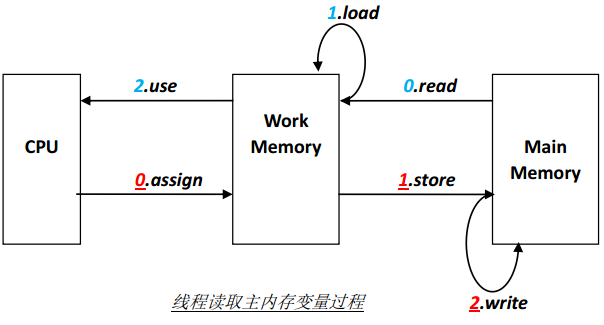

## volatile

- ###作用: 
  1. **保证变量对所有线程的可见性，即一个线程修改了某个值，新值对其他线程来说是立即可见的。(强制从公共堆栈中取得变量的值，而不是从线程私有数据栈中取得变量的值。)**
  
  Java内存模型规定，对于多个线程共享的变量，存储在主内存当中，每个线程都有自己独立的工作内存（比如CPU的寄存器），线程只能访问自己的工作内存，不可以访问其它线程的工作内存。
  工作内存中保存了主内存共享变量的副本，线程要操作这些共享变量，只能通过操作工作内存中的副本来实现，操作完毕之后再同步回到主内存当中。
  volatile保在每次访问变量时都会进行一次刷新，因此每次访问都是主内存中最新的版本。
  
  2. **禁止指令重排序**

  指令重排序是JVM为了优化指令，提高程序运行效率，在不影响单线程程序执行结果的前提下，尽可能地提高并行度。
  但是指令重排序在多线程时会出现一些问题。如下：
  ```
  在线程A中:
  context = loadContext();
  inited = true;
  
  在线程B中:
  while(!inited ){ //根据线程A中对inited变量的修改决定是否使用context变量
     sleep(100);
  }
  doSomethingwithconfig(context);
  
  假设线程A中发生了指令重排序:
  inited = true;
  context = loadContext();
  那么B中很可能就会拿到一个尚未初始化或尚未初始化完成的context,从而引发程序错误。
  ```
  而volatile使用内存屏障可以禁用指令重排序，避免这种问题。
  
- ###与synchronized对比:
  1. volatile可以保证数据的可见性，但不可以保证原子性
  2. synchronized可以保证原子性，也可以间接保证可见性
  3. synchronized有volatile同步的功能
  4. volatile性能一般高于synchronized

- ### 正确使用 volatile 变量的条件
  1. 对变量的写操作不依赖于当前值。(不能是自增自减等操作)
  2. 该变量没有包含在具有其他变量的不变式中。
  包含在具有其他变量的不变式中的情况(包含了一个不变式 —— 下界总是小于或等于上界)：
  ```java
  public class NumberRange {
      private int lower, upper;
      public int getLower() { return lower; }
      public int getUpper() { return upper; }
      public void setLower(int value) { 
          if (value > upper) 
              throw new IllegalArgumentException("");
          lower = value;
      }
      public void setUpper(int value) { 
          if (value < lower) 
              throw new IllegalArgumentException("");
          upper = value;
      }
  }
  ```
  如果凑巧两个线程在同一时间使用不一致的值执行 setLower 和 setUpper 的话，则会使范围处于不一致的状态.
  例如，如果初始状态是(0, 5)，同一时间内，线程 A 调用 setLower(4) 并且线程 B 调用 setUpper(3)，
  显然这两个操作交叉存入的值是不符合条件的，那么两个线程都会通过用于保护不变式的检查，
  使得最后的范围值是 (4, 3) —— 一个无效值。
  
- ###volatile可以解决的问题示例:
```java
public class RunThread extends Thread{
    private boolean isRunning=true;
    public boolean isRunning(){
        return isRunning;
    }
    public void setRunning(boolean isRunning){
        this.isRunning=isRunning;
    }
    @Override
    public void run(){
        System.out.println("进入run了");
        while (isRunning==true){
        }
        System.out.println("线程被停止了");
    }
}

public class Main{
    public static void main(String args[]){
        try{
            RunThread thread=new RunThread();
            thread.start();
            Thread.sleep(1000);
            thread.setRunning(false);
            System.out.println("已经赋值为false");
        }catch (InterruptedException e){
            e.printStackTrace();
        }
    }
}
```
运行时加入JVM参数, -server。查看结果发现System.out.println("线程被停止了");从未执行。

因为JVM被设置为-server模式时为了线程的运行效率，线程一直在私有堆栈中取得isRunning的值为true，而更新的却是公共堆栈中的isRunning。

解决方法：volatile private boolean isRunning=true;

- ###线程工作内存和主工作内存之间通过8中原子操作实现

    1. lock（锁定）：作用于主内存的变量，它把一个变量标识为一条线程独占的状态。
    
    2. unlock（解锁）：作用于主内存的变量，它把一个处于锁定状态的变量释放出来，释放后的变量才可以被其它线程锁定。
    
    3. read（读取）：作用于主内存的变量，它把一个变量的值从主内存传输到线程的工作内存中，以便随后的load动作使用。
    
    4. load（载入）：作用于工作内存的变量，它把read操作从主内存中得到的变量值放入工作内存的变量副本中。
    
    5. use（使用）：作用于工作内存的变量，它把工作内存中一个变量的值传递给执行引擎，每当虚拟机遇到一个需要使用到变量的值的字节码指令时将会执行这个操作。
    
    6. assign（赋值）：作用于工作内存的变量，它把一个从执行引擎接收到的值赋给工作内存的变量，每当虚拟机遇到一个给变量赋值的字节码指令时执行这个操作。
    
    7. store（存储）：作用于工作内存的变量，它把工作内存中一个变量的值传送给主内存中，以便随后的write操作使用。
    
    8. write（写入）：作用于主内存的变量，它把store操作从工作内存中得到的变量的值放入主内存的变量中。

    

    ***对于volatile修饰的变量，只能保证从主内存到工作内存的值是最新的，但像use和assign这些操作并不是原子性的，因此volatile无法保证原子性***

- ###使用原子类进行i++操作
```java
import java.util.concurrent.atomic.AtomicInteger; 
public class AddCountThread extends Thread{
    private AtomicInteger count=new AtomicInteger(0);
    @Override
    public void run(){
        for (int i=0;i<1000;i++){
            System.out.println(count.incrementAndGet());
        }
    }
}

public class Main{
    public static void main(String args[]){
        AddCountThread thread=new AddCountThread();
        new Thread(thread).start();
        new Thread(thread).start();
        new Thread(thread).start();
        new Thread(thread).start();
        new Thread(thread).start();
    }
}
```

- ###原子类也不完全安全
```java
import java.util.concurrent.atomic.AtomicLong;
public class MyService{
    public static AtomicLong aiRef=new AtomicLong();
    public void addNum(){
        System.out.println(Thread.currentThread().getName()+"加了100后的值是:"+aiRef.addAndGet(100));
        aiRef.addAndGet(1);
    }
}

public class MyThread extends Thread{
    private MyService myService;
    public MyThread(MyService myService){
        super();
        this.myService=myService;
    }
    @Override
    public void run(){
        myService.addNum();
    }
}

public class Main{
    public static void main(String args[]){
        try{
        MyService service=new MyService();
        MyThread[] myThreads=new MyThread[5];
        for (int i=0;i<myThreads.length;i++){
            myThreads[i]=new MyThread(service);
        }
        for (int i=0;i<myThreads.length;i++){
            myThreads[i].start();
        }
        Thread.sleep(1000);
        System.out.println(service.aiRef.get());    
        }catch (InterruptedException e){
            e.printStackTrace();
        }
    }
}
```

运行发现打印出错，这是因为addAndGet()方法虽然是原子性的，但方法与方法之间的调用不是原子性的。

-  

#####参考:
- JAVA多线程编程核心技术
- 深入理解Java虚拟机
- http://www.codeceo.com/article/jvm-memory-model-visual.html?utm_source=tuicool&utm_medium=referral
- http://www.importnew.com/23535.html?utm_source=tuicool&utm_medium=referral
- http://www.jianshu.com/p/03a8f06ede46?utm_source=tuicool&utm_medium=referral