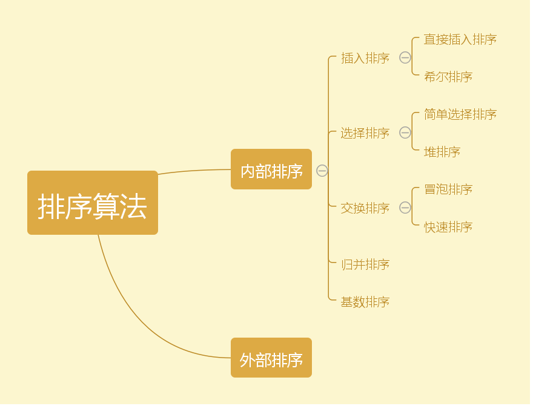
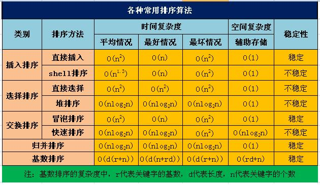
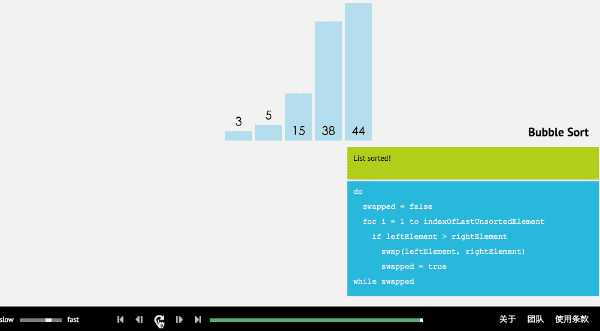
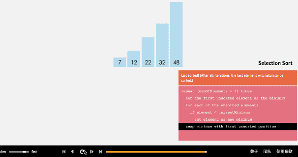
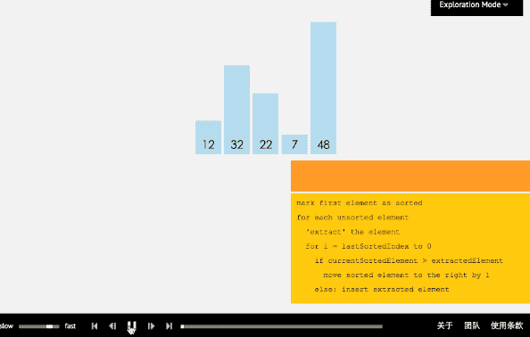
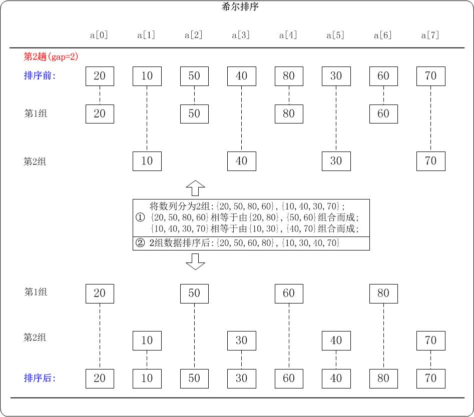
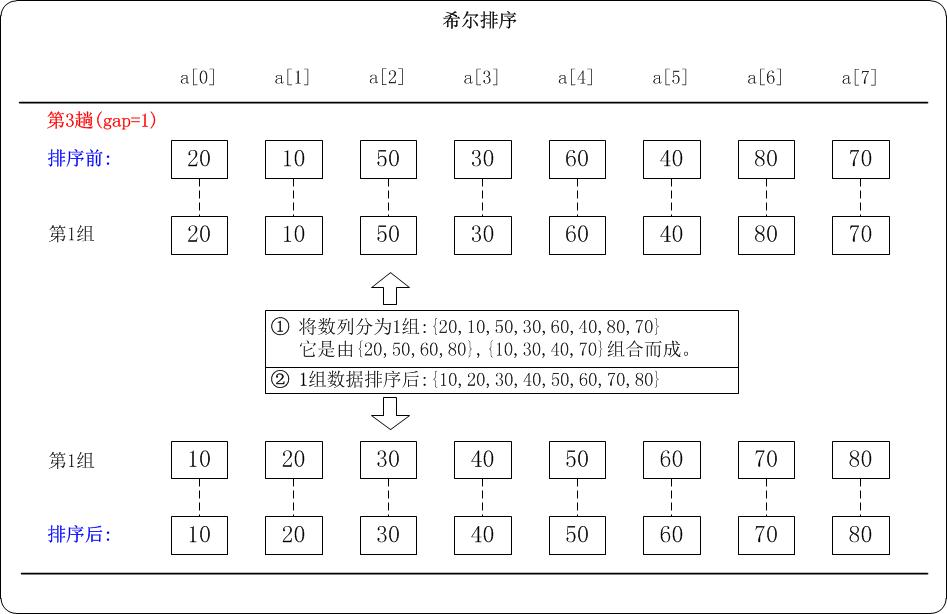

# 排序

- ###　移动方式

  1. **直接移动**： 直接交换存储数据的位置。
  
  2. **逻辑移动**：不会移动数据的位置，仅改变指向这些数据的值。

- ### 排序的分类

  1. **内部排序**：排序的数据量小，可以完全在内存进行排序。
  
  2. **外部排序**：排序的数据量无法直接在内存中进行排序，而必须使用辅助存储器。

  常见的内部排序有：冒泡排序，选择排序，插入排序，合并排序，快速排序，堆积排序，
  希尔排序，基数排序等。
  
  常见的外部排序有：直接合并排序，k路合并，多相合并等
  
  
  
- ### 排序算法的选择
  大约可以考虑一下三种因素。
  - **是否稳定**

    稳定的排序是指数据在经过排序后，两个相同键值的数据仍保持原来的数据。

    ```
    原始数据顺序：  7(左)  2   9   7(右) 6
    稳定的排序：    2    6  7(左) 7(右) 9
    不稳定的排序：  2    6  7(右) 7(左) 9
    ```
    
  - **时间复杂度**

  - **空间复杂度**
  
  
  
- ### 冒泡排序

  > 适用于数据量较小且有部分数据已经经过排序的情况。

  ```
  步骤:
  1. 将序列当中的左右元素依次比较，保证右边的元素始终大于左边的元素。
  2. 对序列当中剩下的n-1个元素再次执行步骤1。
  3. 对于长度为n的序列，一共需要执行n-1轮比较
  
  简单来说，第一次确定最大值，第二次确定第二大置，依次完成排序。
  ```
  
  
  
  ```java
  public class Main {
      public static void main(String args[]){
          int[] array=new int[]{6,5,8,4,36,78,9,46,2,5,0,7};
          for (int i: bubbleSort(array)){
              System.out.print(i+" ");
          }
      }
      public static int[] bubbleSort(int[] array){
        if (array==null || array.length<1){
            return null;
        }
        for(int i=0;i<array.length;i++){
            for (int j=1;j<array.length-i;j++){
                if (array[j]<array[j-1]){
                    int temp=array[j];
                    array[j]=array[j-1];
                    array[j-1]=temp;
                }
            }
        }
        return array;
      }
  }
  ```

- ### 简单选择排序 

  > 适用于数据量较小且有部分数据已经经过排序的情况。
 
  ```
  步骤：
  1. 从待排序序列中，找到关键字最小的元素；
  2. 如果最小元素不是待排序序列的第一个元素，将其和第一个元素互换；
  3. 从余下的 N - 1 个元素中，找出关键字最小的元素，重复(1)、(2)步，直到排序结束。
  ```
  
   
   
  ```java
  public class Main {
      public static void main(String args[]){
          int[] array=new int[]{6,5,8,4,36,78,9,46,2,5,0,7};
          for (int i: simpleSelectionSort(array)){
              System.out.print(i+" ");
          }
      }
      public static int[] simpleSelectionSort(int[] array){
         for(int j=0;j<array.length;j++) {
             int min=j;
             for (int i = j; i < array.length; i++) {
                 if (array[min] > array[i]) {
                     min = i;
                 }
             }
             int temp = array[j];
             array[j] = array[min];
             array[min] = temp;
         }
         return array;
      }
  }
  ```
- ## 直接插入排序
   
  > 适用于大部分数据已经经过排序或已排序的数据库新增数据后进行排序的情况。只需要一个额外空间，空间复杂度最佳；
    会造成数据大量的迁移，宜使用链表实现。
  
   ```
   步骤：
  每次将一个待排序的记录，按其关键字大小插入到前面已经排好序的子序列中的适当位置，直到全部插入完成。
  设数组为a[0...n-1]
  1. 初始时，a[0]自成一个有序区，无序区为a[1...n-1]。令i=1
  2. 将a[i]并入当前有序区a[0...i-1]中形成a[0...i]的有序区间
  3. i++重复第二步直到i==n-1。排序完成
   ```
   
  
    
  ```java
  public class Main {
      public static void main(String args[]){
  
      }
      public static int[] insertSort(int[] array){
          if(array==null||array.length<1){
              return null;
          }
          if (array.length==1){
              return array;
          }
          for (int i = 1; i < array.length; i++) {
              if (array[i] < array[i - 1]) { // 如果i > i-1的话就不需要移动了
                  int tmp = array[i]; // 暂存i的值
                  int j;
                  for (j = i - 1; j >= 0 && array[j] > tmp; j--) { // 从0到i-1，如果0到i-1有大于i的数，全部后移
                      array[j + 1] = array[j];
                  }
                  array[j + 1] = tmp; // 将i的值 插入到当前位置
              }
          }
          return array;
      }
  }

  ```
   
- ## 希尔排序
  
  > 适用于大部分数据已完成排序的情况
  
  ```
  步骤：
  1. 对一个数组长度为N的数组，取一个小于N的整数gap(gap称为步长)
  2. 根据该步长将数组分为若干个子数组，所有距离为gap的倍数的记录放在同一个子数组
  3. 对每个子数组进行插入排序
  4. 然后缩减gap的值，并重复上面的分组和排序
  5. 当gap==1时，整个数组就是有序的
  ```
  
  
  (参考：http://haoran-10.iteye.com/blog/2266811)
  
  下面以数列{80,30,60,40,20,10,50,70}为例，演示它的希尔排序过程：
   
   **第1趟：(gap=4)**
   
   ```
   当gap=4时,意味着将数列分为4个组： 
   {80,20},{30,10},{60,50},{40,70}。 对应数列： {80,30,60,40,20,10,50,70}
   对这4个组分别进行排序，排序结果： 
   {20,80},{10,30},{50,60},{40,70}。 对应数列： {20,10,50,40,80,30,60,70}
   ```

   
  
   **第2趟：(gap=2)** 

   ```
   当gap=2时,意味着将数列分为2个组：
   {20,50,80,60}, {10,40,30,70}。 对应数列： {20,10,50,40,80,30,60,70}
   注意：{20,50,80,60}实际上有两个有序的数列{20,80}和{50,60}组成。
        {10,40,30,70}实际上有两个有序的数列{10,30}和{40,70}组成。
   对这2个组分别进行排序，排序结果：
   {20,50,60,80}, {10,30,40,70}。 对应数列： {20,10,50,30,60,40,80,70}
   ```
   
    
    
   **第3趟：(gap=1)**
   
   ```
   当gap=1时,意味着将数列分为1个组：{20,10,50,30,60,40,80,70}
   注意：{20,10,50,30,60,40,80,70}实际上有两个有序的数列{20,50,60,80}和{10,30,40,70}组成。
   对这1个组分别进行排序，排序结果：{10,20,30,40,50,60,70,80}
   ```
   
   
   
   ```java
   public class Main {
       public static void main(String args[]){
           int[] array=new int[]{6,5,8,4,36,78,9,46,2,5,0,7};
           for (int i: shellSort(array)){
               System.out.print(i+" ");
           }
       }
   
       public static int[] shellSort(int[] a){
           if(a==null || a.length<1){
               return null;
           }
           int n = a.length;
           for(int gap=n/2; gap>0; gap /=2){
               for(int i=0; i<gap; i++){
                   for(int j=i+gap; j<n; j+=gap){
                       int temp = a[j];
                       for(int k=j-gap; k>=0&&a[k]>temp;k-=gap){
                           a[k+gap] = a[k];
                           a[k] = temp;
                       }
                   }
               }
           }
           return a;
       }
   }

   ```
   
- ## 参考
  - http://www.jianshu.com/p/7d037c332a9d
  - http://haoran-10.iteye.com/blog/2266811
  - 《图解数据结构-java版》