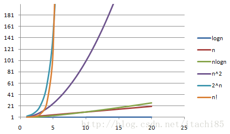

1. ### 算法效能分析
   对一个程序效能的评估，经常从时间和空间两方面就行考虑。时间方面指的是时间的运行时间，称为"时间复杂度"；
   空间方面指的是计算机内存占用空间的大小，称为"空间复杂度"。

2. ### 时间复杂度

- **时间频度** 
一个算法执行所耗费的时间，从理论上是不能算出来的，必须上机运行测试才能知道。
但我们不可能也没有必要对每个算法都上机测试，只需知道哪个算法花费的时间多，
哪个算法花费的时间少就可以了。并且一个算法花费的时间与算法中语句的执行次数成正比例，
哪个算法中语句执行次数多，它花费时间就多。一个算法中的语句执行次数称为语句频度或时间频度。记为T(n)。

- **时间复杂度** 
前面提到的时间频度T(n)中，n称为问题的规模，当n不断变化时，时间频度T(n)也会不断变化。
但有时我们想知道它变化时呈现什么规律，为此我们引入时间复杂度的概念。
一般情况下，算法中基本操作重复执行的次数是问题规模n的某个函数，用T(n)表示，
若有某个辅助函数f(n)，使得当n趋近于无穷大时，T（n)/f(n)的极限值为不等于零的常数，
则称f(n)是T(n)的同数量级函数，记作T(n)=O(f(n))，它称为算法的渐进时间复杂度，简称时间复杂度。

3. ### Big-oh
   大O表示法就是将算法的所有步骤转换为代数项，然后排除不会对问题的整体复杂度产生较大影响的较低阶常数和系数。
   简而言之，只关注表达式中对表达式最终结果会产生最大影响的因子。
   
   - #### 时间复杂度的分析方法：
       1. 时间复杂度就是函数中基本操作所执行的次数
       2. 一般默认的是最坏时间复杂度，即分析最坏情况下所能执行的次数
       3. 忽略掉常数项
       4. 关注运行时间的增长趋势，关注函数式中增长最快的表达式，忽略系数
       5. 计算时间复杂度是估算随着n的增长函数执行次数的增长趋势
       6. 递归算法的时间复杂度为：递归总次数 * 每次递归中基本操作所执行的次数
       
   - #### 常用的时间复杂度：
      常用的时间复杂度有以下七种，算法时间复杂度依次增加：
      O(1)常数型、O(log2 n)对数型、O(n)线性型、O(nlog2n)二维型、O(n^2)平方型、
      O(n^3)立方型、O(2^n)指数型.
      
      
  
   - **O(1)常数型**
     ```
       int sum = 0,n = 100; //执行一次  
       sum = (1+n)*n/2; //执行一次  
       System.out.println(sum); //执行一次 
       
       运行的次数的函数为f(n)=3，根据推导大O阶的规则1，我们需要将常数3改为1，则这个算法的时间复杂度为O(1)。
     ```
   
   - **O(log2 n)对数型**
     ```
     int number=1;
     while(number<n){
     number=number*2;
     //时间复杂度为O(1)的算法
     }
     
     随着number每次乘以2后，都会越来越接近n，当number不小于n时就会退出循环。
     假设循环的次数为X，则由2^x=n得出x=log₂n，因此得出这个算法的时间复杂度为O(logn)
     ```
    
   - **O(n)线性型**
     ```
     for(int i=0;i<n;i++){
     //时间复杂度为O(1)的算法
     }
     
     算法循环体中的代码执行了n次，因此时间复杂度为O(n)。
     ```
    
   - **O(n^2)平方型**
     ```
     for(int i=0;i<n;i++){   
         for(int j=0;j<n;i++){
            //复杂度为O(1)的算法
         }
     }
     
     内层循环的时间复杂度O(n)，现在经过外层循环n次，那么这段算法的时间复杂度则为O(n²)。 
     ```
   
- ## 参考
  - 《大话数据结构》
  - 《图解数据结构-JAVA版》
  - http://blog.csdn.net/itachi85/article/details/54882603
  - http://blog.csdn.net/lf_2016/article/details/52453212