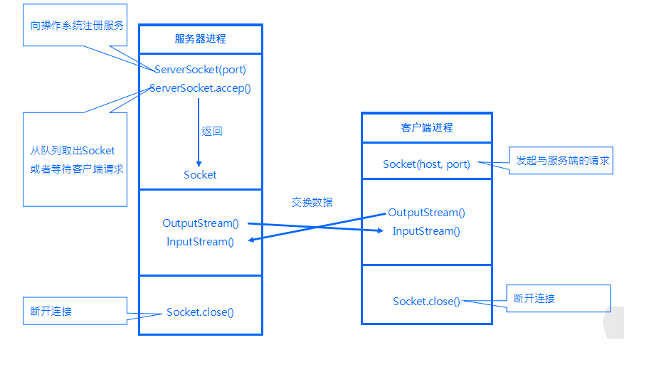

#### 1. 通过HttpServletRequest. getParameter获取的参数.
```
A. 总是采用UTF-8编码
B. 总是采用lS08859-1编码
C. 由客户端浏览器和Web容器配置共同决定编码
D. 由服务器所在的操作系统决定编码

正解: C
解析：1、浏览器根据jsp页面开头声明的编码方式对request中参数编码；
     2、tomcat默认解码是ISO-8859-1， 
     但是我们可以显示指定解码格式通过调用 
     request.setCharacterEncoding("UTF-8")，
     或者修改tomcat的配置文件server.xml中的编码，添加uriEncoding属性。
```

#### 2. 如果希望监听TCP端口9000，应该怎样创建socket?
```
A. new Socket("localhost",9000);
B. new ServerSocket(9000);
C. new Socket(9000);
D. new ServerSocket("localhost",9000);

正解: B
解析： ServerSocket(int port) 是服务端绑定port端口，调accept()监听等待客户端连接，它返回一个连接队列中的一个socket。
      Socket(InetAddress address , int port)是创建客户端连接主机的socket流，其中InetAddress是用来记录主机的类，port指定端口。
```
 
 
#### 3. 下列有关Servlet的生命周期，说法不正确的是？
```
A. 在创建自己的Servlet时候，应该在初始化方法init()方法中创建Servlet实例
B. 在Servlet生命周期的服务阶段，执行service()方法，根据用户请求的方法，执行相应的doGet()或是doPost()方法
C. 在销毁阶段，执行destroy()方法后会释放Servlet 占用的资源
D. destroy()方法仅执行一次，即在服务器停止且卸载Servlet时执行该方法

正解： A
解析： Servlet的生命周期分为5个阶段：加载、创建、初始化、处理客户请求、卸载。
(1)加载：容器通过类加载器使用servlet类对应的文件加载servlet
(2)创建：通过调用servlet构造函数创建一个servlet对象
(3)初始化：调用init方法初始化
(4)处理客户请求：每当有一个客户请求，容器会创建一个线程来处理客户请求
(5)卸载：调用destroy方法让servlet自己释放其占用的资源
并不是在init()方法中创建Servlet实例
```

#### 4.HttpSession session = request.getSession(false) 与HttpSession session = request.getSession(true)的区别？
```
A. 没有区别
B. 如果当前reqeust中的HttpSession 为null，当传入参数为空时，就创建一个新的Session，否则返回null
C. 如果当前reqeust中的HttpSession 为null，当传入参数为true时，就创建一个新的Session，否则返回null

正解：BC
解析：
1、request.getSession() 等价于 request.getSession(true) 
这两个方法的作用是相同的，查找请求中是否有关联的session id，如果有则返回这个号码所对应的session对象，如果没有则生成一个新的session对象。所以说，通过此方法是一定可以获得一个session对象。 
2、request.getSession(false) 查找请求中是否有关联的session id，如果有则返回这个号码所对应的session对象，如果没有则返回一个null。
```


## 习题来源或参考：
   - 牛客网